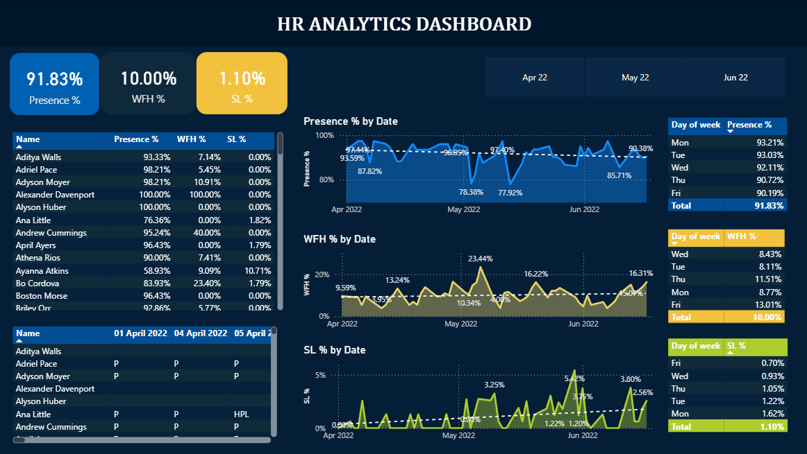
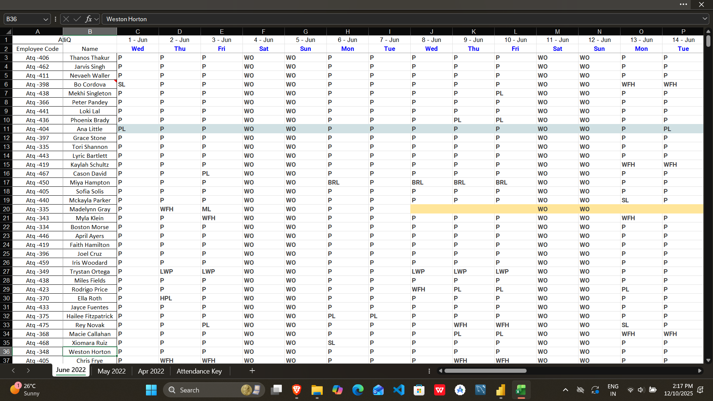
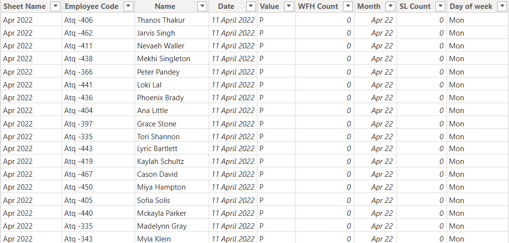
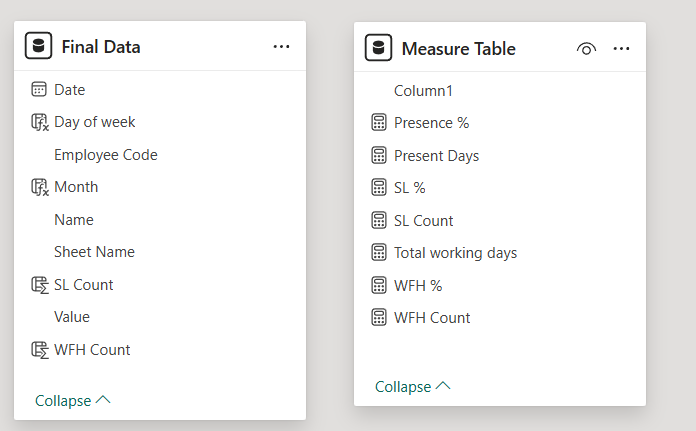
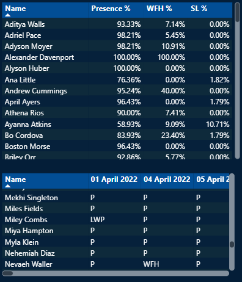
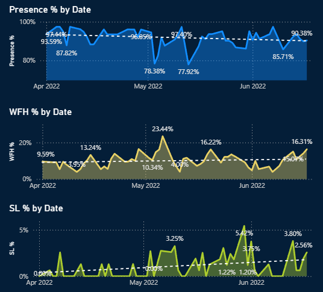
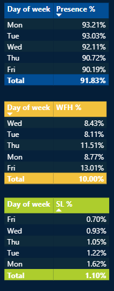

# 🌟 HR Analytics Dashboard – Power BI

### An Interactive Workforce Intelligence System for Attendance, Hybrid Work & HR Optimization

---

<p align="center">
  
</p>

---

# 🧭 1. Project Overview

This HR Analytics Dashboard provides deep insights into:

* **Presence %**
* **Work From Home (WFH) patterns**
* **Sick Leave (SL) behavior**
* **Employee-level attendance behavior**
* **Weekday workforce trends**
* **Hybrid work optimization**
* **Health-related absenteeism**

The project showcases full-stack BI workflow:

✔ Data Cleaning (Power Query)
✔ Data Modeling (Star Schema)
✔ KPI Creation (DAX)
✔ Dashboard Visualization (Power BI)
✔ HR-Focused Insights (Storytelling)

---

# 🏢 2. Business Problem

HR teams struggled with:

* Raw, unstructured Excel attendance data
* No real-Time visibility into workforce presence
* Unpredictable WFH trends
* Rising sick leaves unnoticed
* Office space under-utilization
* Difficulty planning events
* Preparation for a new HRMS migration

**Objective:**
Convert raw data into a **professional, interactive dashboard** that helps HR make faster & better decisions.

---

# 📂 3. Dataset Summary

<p align="center">
  
</p>

### Files:

`Attendance-Sheet-2022-2023.xlsx`
Contains sheets: **April 2022**, **May 2022**, **June 2022**

### **Attendance Codes:**

| Code  | Meaning        |
| ----- | -------------- |
| P     | Present        |
| WFH   | Work From Home |
| HPL   | Half-day WFH   |
| SL    | Sick Leave     |

---

# 🧹 4. Data Cleaning & Transformation (Power Query)

<p align="center">
  
</p>

### ✔ Major Steps:

* Imported all sheets
* Appended them into single table
* Unpivoted date columns
* Standardized attendance codes
* Added new calculated columns:

  * Presence Flag
  * WFH Count
  * SL Count
  * Month
  * Day of Week

> Result: a **clean, analysis-ready dataset** stored in a fact table.

---

# 🗂 5. Data Model (Star Schema)

<p align="center">
  
</p>

### Tables:

* `Final Data` (Fact)
* `Date Table` (Dimension)
* `Measure Table` (DAX KPIs)

### Relationships:

`Date[Date] → Final Data[Date]`

---

# 🧮 6. DAX Metrics (KPIs)

### Total Working Days

```DAX
Total working days = COUNTROWS('Final Data')
```

### **Presence %**

```DAX
Presence % = DIVIDE([Present Days], [Total working days], 0)
```

### **WFH %**

```DAX
WFH % = DIVIDE([WFH Count], [Total working days], 0)
```

### **SL %**

```DAX
SL % = DIVIDE([SL Count], [Total working days], 0)
```

---

# 📊 7. Dashboard Screenshots

### ⭐ Main Dashboard Overview

<p align="center">
  
</p>

---

### ⭐ Employee Summary View

<p align="center">
  
</p>

---

### ⭐ Attendance Trends (Presence, WFH, SL)

<p align="center">
  
</p>

---

# 🔍 8. Key Insights Generated

<p align="center">
  
</p>

### 📌 Insight 1 — WFH peaks on Monday & Friday

Employees prefer hybrid edges of the week.

### 📌 Insight 2 — Best team event days

Tuesday & Wednesday have highest office presence.

### 📌 Insight 3 — Sick leave spike in June

Potential flu season or health-related issue.

### 📌 Insight 4 — Low Friday occupancy

Opportunity to reduce office seating cost.

### 📌 Insight 5 — Employee attendance patterns

Identified low/high performers for HR intervention.

---

# 🏢 9. Business Impact

### ✔ Improved workforce visibility

### ✔ Smarter hybrid work planning

### ✔ Space cost optimization

### ✔ Better employee wellness tracking

### ✔ Ideal scheduling for HR events

### ✔ Migration-ready structured data

---

# 🚀 10. Future Enhancements

* Predict absenteeism using Machine Learning
* Auto alerts via email/Teams
* Department-level segmentation
* Integrate HRMS APIs
* Build an HR wellness index

---

# 🎤 11. Interview Script (Use This Answer)

> “This dashboard displays my end-to-end BI skills. I cleaned the raw Excel attendance sheets using Power Query, created a star schema, built DAX KPIs, and designed an interactive Power BI dashboard that solves real HR problems.
> It helps HR teams monitor hybrid work patterns, optimize office capacity, schedule events effectively, and detect sick-leave risks early. The solution is scalable and ready for HRMS integration.”

---

# 📁 12. Folder Structure

```
HR-Analytics-Dashboard/
│── data/
│   └── Attendance-Sheet-2022-2023.xlsx
│
│── images/
│   ├── main_dashboard.png
│   ├── employee_summary.png
│   ├── trends.png
│   ├── data_model.png
│   ├── power_query_flow.png
│   ├── raw_excel.png
│   ├── insights_summary.png
│   └── business_impact.png
│
│── powerbi/
│   └── HR_Dashboard.pbix
│
└── README.md
```

---

# 🏁 13. Conclusion

This project demonstrates:

* ✔ Strong BI expertise
* ✔ Business problem-solving
* ✔ HR domain understanding
* ✔ DAX mastery
* ✔ Power Query transformation
* ✔ Actionable insights & storytelling
